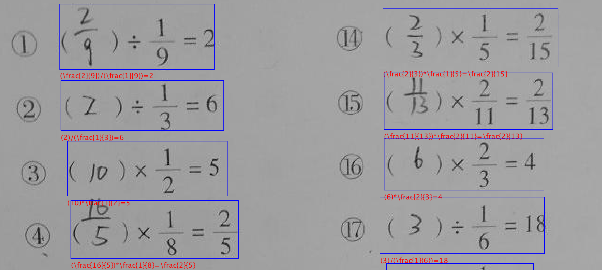

<!--   -->

### Introduction
<p align='center'>
  
</p>

AEC-5k is a dataset focused on text spotting of arithmetic exercises.
The exercise images cover the entire grades of Chinese primary students (usually from age 6 to 12). 
This dataset contains 77, 098 expressions.
Annotation of each expression has two attributes: 1) a bounding box that covers the entire AE even if it is multi-lined, and 2) a char-level text annotation. 

Paper: [Link](https://ojs.aaai.org/index.php/AAAI/article/view/5410/5266) 

Data download link: [Link](https://pan.baidu.com/s/1kKWdqGao4f8G_kOFnt8VeA) code: u1uw

#### Some Notes:
* Annotations of several expressions on the edge of images are deleted, which aims to ensure the semantic compactness of expressions.

### Annotation Format:
The annotation format for each bounding box is: (CHARS, x1, y1, x2, y2, 1), which indicates 1) character sequences, 2) coordinates of top left corner, 3) coordinates of bottom right corner and 4) a placeholder.
Supported expressions are listed as follows:
* Single-lined expressions, like `1+1=2`, `3米=300厘米`.
* Vertical expressions, like: `!30#×31#&!30#30!#&930`, here `!` indicates a space symbol, `&` indicates a horizontal line and `#` stands for a newline symbol.
* Multi-lined expressions, like `1+2+3#=4+5#=6`.
* Fractions, like `\frac{1}{3}/\frac{1}{3}=1`.
* Formulas, like `x+1=2`.

### Supported Symbols
* `1234567890()[].+-$*÷=><≈≥≤≠□`
* x, y, z
* `\sqrt`、`\frac`、#、&、!、|
* '年', '月', '星期', '日', 天', '时', '分', '秒', '毫秒'
* '吨', '千克', '克', '毫克'
* '元', '角', '分'
* '亿', '万', '千', '百', '十', '个'
* '千米', '公里', '米', '分米', '厘米', '毫米'
* '平方千米', '平方公里', '公顷', '平方米', '平方分米', '平方厘米', '平方毫米'
* '升', '毫升', '立方米', '立方分米', '立方厘米'
* 't', 'kg', 'g', 'mg'
* 'km', 'm', 'dm', 'cm', 'mm', 'L', 'mL' and related square / cube operations.

### Release Updates
* Sep 23, 2021: release v1.0

### Copyright
Tencent is pleased to support the open source community by making the dataset available. 
Copyright (C) 2021 THL A29 Limited, a Tencent company.  
The images and related annotations are licensed under a Creative Commons Attribution 4.0 International License.

### Citation
If you find AEC-5k useful in your research, please consider citing: 
```
@inproceedings{hu2020accurate,
  title={Accurate Structured-Text Spotting for Arithmetical Exercise Correction},
  author={Hu, Yiqing and Zheng, Yan and Liu, Hao and Jiang, Deqiang and Liu, Yinsong and Ren, Bo},
  booktitle={Proceedings of the AAAI Conference on Artificial Intelligence},
  volume={34},
  number={01},
  pages={686--693},
  year={2020}
}
```

### Contact
For any question, please file an issue or contact
```
Yiqing Hu: hooverhu@tencent.com
Yan Zheng: neoyzheng@tencent.com
```